# 🧑‍💼 Full Stack Job Portal Web Application

This is a full-fledged Job Portal Web Application built using the **MERN Stack** (MongoDB, Express.js, React.js, Node.js), aimed at connecting job seekers with recruiters efficiently. The platform is designed to provide seamless job searching, application tracking, and job management functionalities for both users and recruiters.

---

## 🌐 Project Overview

This project is a **Job Listing & Job Application Portal**, where:

- ✅ **Job Seekers** can:
  - Search and filter job listings by keywords, location, and role.
  - Apply for job postings directly through the platform.
  - Upload and manage resumes on their profile.
  - Sign up and log in securely via **Clerk** authentication.

- 🛠️ **Recruiters** have access to a dedicated **Dashboard** where they can:
  - Post new job openings with customized descriptions.
  - Manage all active job listings.
  - View, accept, or reject job applications.
  - View candidate resumes for informed decision-making.

---

## 🚀 Tech Stack

| Layer        | Technology Used               |
|--------------|-------------------------------|
| Frontend     | React.js, Tailwind CSS        |
| Backend      | Node.js, Express.js           |
| Database     | MongoDB                       |
| Auth System  | Clerk.dev (for job seekers)   |
| Deployment   |                               |
| Monitoring   | Sentry (for error tracking, MongoDB performance monitoring) |

---

## 📈 Key Features

- 🔐 **User Authentication**  
  Secure and modern authentication system for job seekers using Clerk.

- 📄 **Resume Upload & Profile Management**  
  Users can upload and update their resumes for recruiters to view.

- 🧭 **Job Search and Filtering**  
  Search jobs by role, location, keywords, and other filters.

- 🧑‍💼 **Recruiter Dashboard**  
  Post jobs, manage listings, track applicants, and review resumes.

- 📊 **Error Tracking with Sentry**  
  Integrated Sentry to monitor runtime errors, backend exceptions, and optimize MongoDB queries for improved performance.

---

## 🖼️ Screenshots

| **Page** | **Screenshot** |
|----------|----------------|
| **Job Portal Dashboard** | 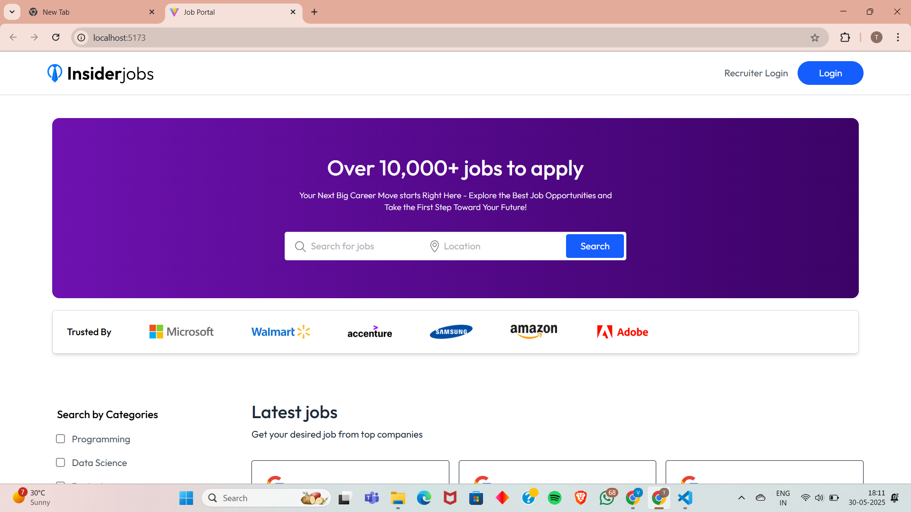 |
| **Latest Jobs and Filters** | 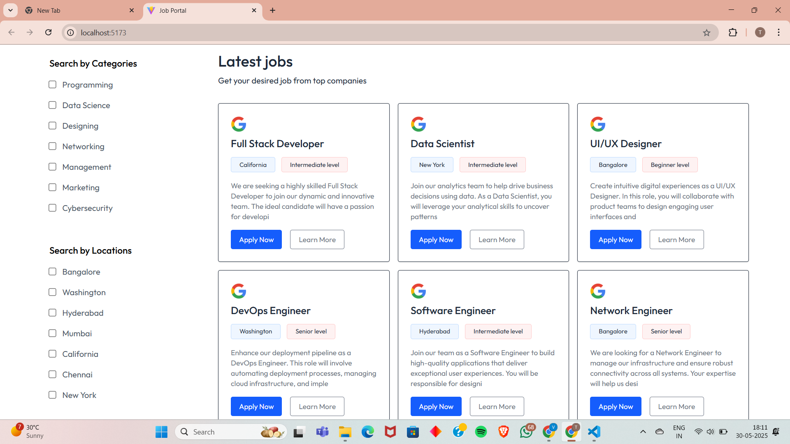 |
| **Footer** | 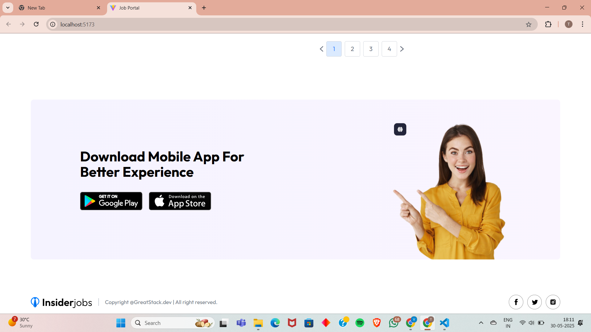 |
| **Sign In With Clerk** | 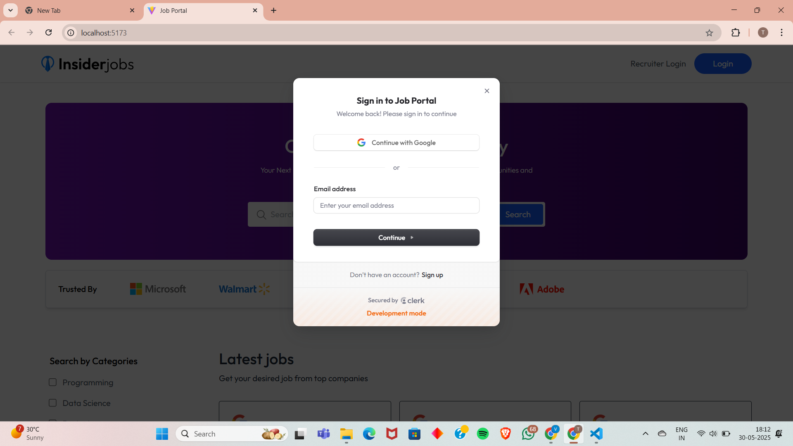 |
| **Logged In** | 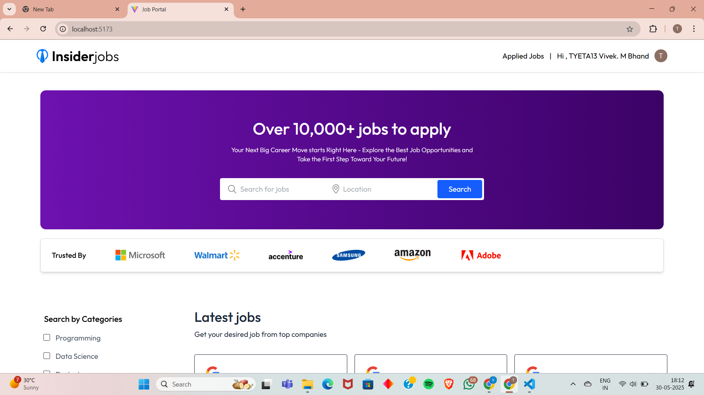 |
| **Apply Job Page** | 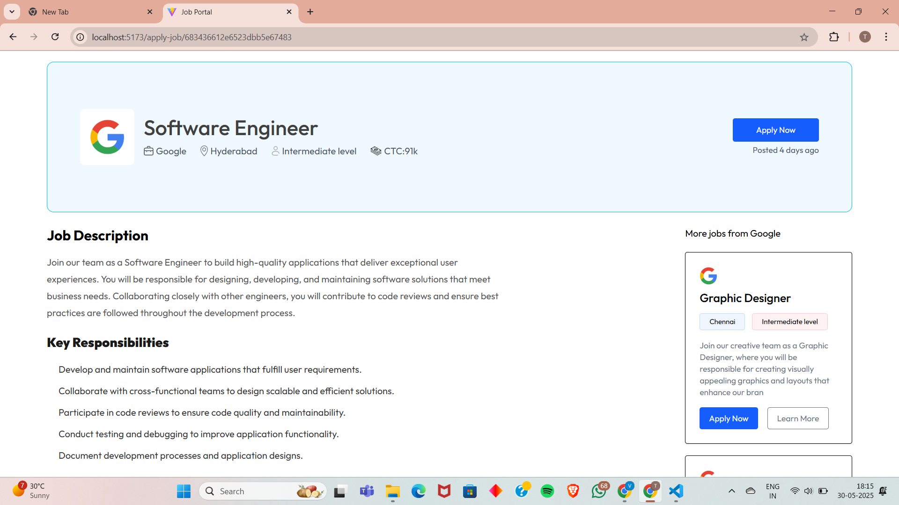 |
| **Applied to Job** | 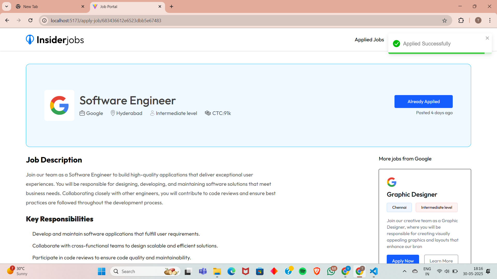 |
| **All Applied Jobs and Option to Upload Resume** |  |
| **Recruiter Login** | 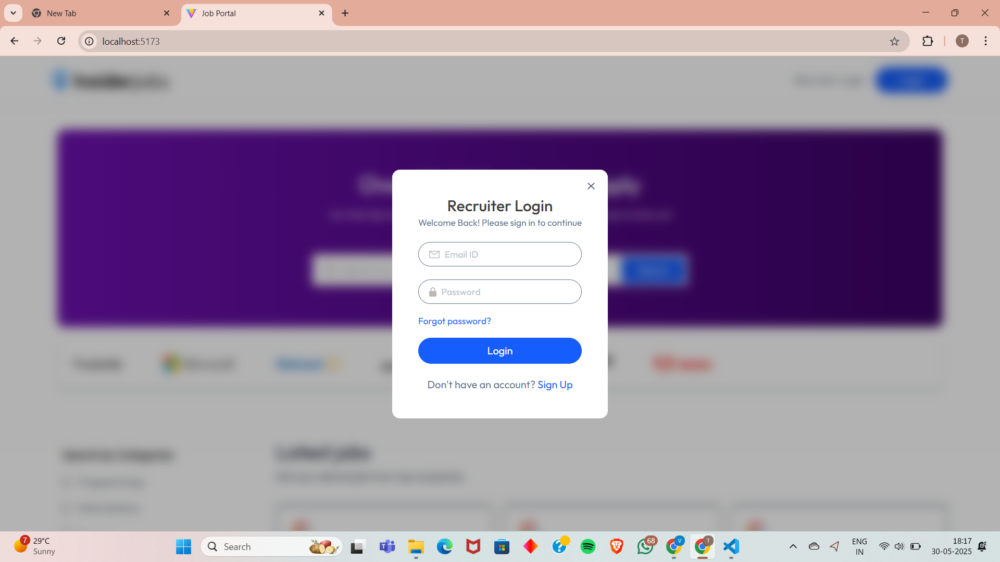 |
| **Application Management Page** | 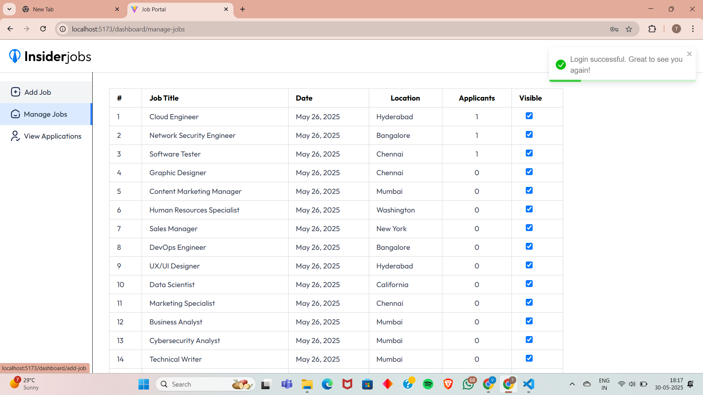 |
| **Job Posting Page** | 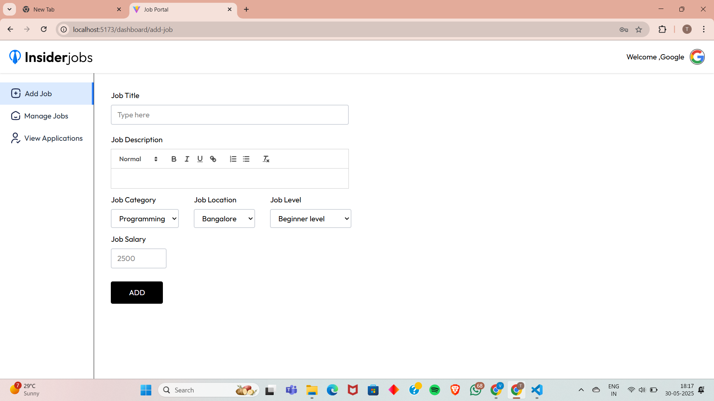 |
| **View Applications Page** | 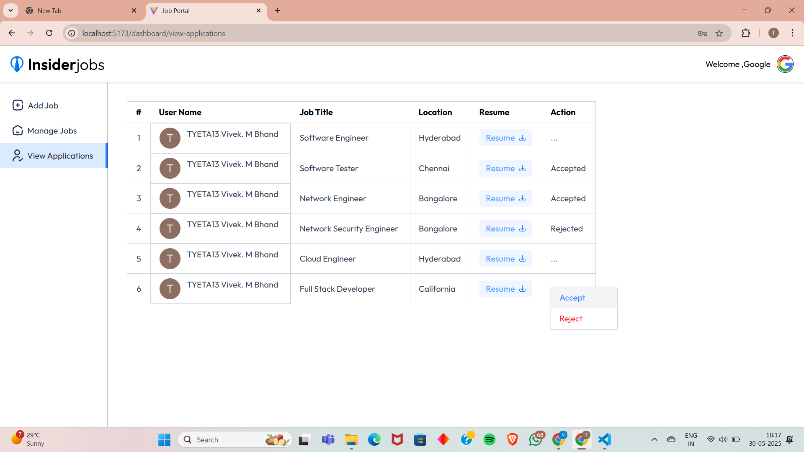 |
---

👉 **To see more features, visit the live website**
